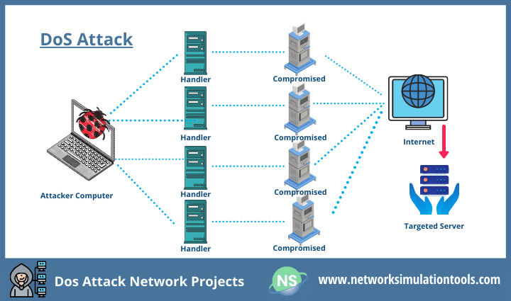
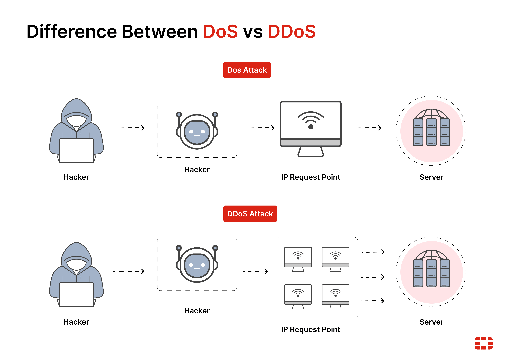
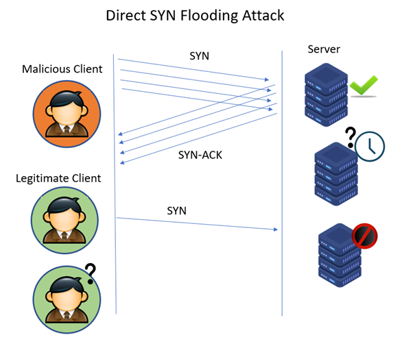
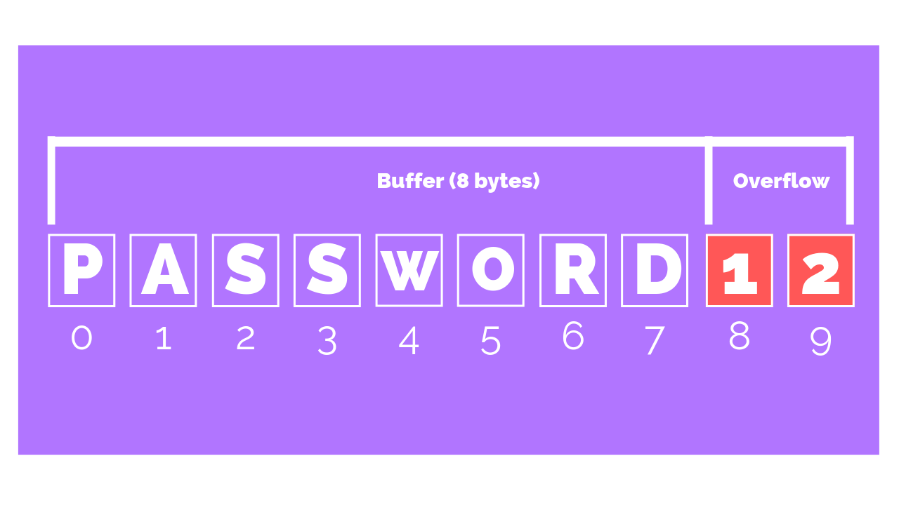

# Availability Attacks
- [Availability Attacks](#availability-attacks)
  - [Availability Attacks](#availability-attacks-1)
  - [Availability attack methods](#availability-attack-methods)
    - [Denial of Service (DoS)](#denial-of-service-dos)
    - [Distributed Denial of Service (DDoS)](#distributed-denial-of-service-ddos)
    - [TCP SYN Flood](#tcp-syn-flood)
    - [Buffer Overflow](#buffer-overflow)

---

## Availability Attacks

- attempt to limit the accessibility and usability of a system.
- Availability attacks vary widely,
  - consume the processor or memory resources on a target system, that system might be unavailable to legitimate users.
- doing physical damage to that system.

## Availability attack methods

### Denial of Service (DoS)

- `sending the target system a flood of data or requests` that consume the target system’s resources.
- some operating systems (OS) and applications might crash when they receive specific strings of improperly formatted data,
- attacker could leverage such OS/application vulnerabilities to `render a system/ application inoperable`.
- The attacker often uses `IP spoofing` to conceal his identity when launching a DoS attack.

### Distributed Denial of Service (DDoS)

- DDoS attacks can `increase the amount of traffic flooded` to a target system.
- an attacker compromises multiple systems (`zombies`), which can `be instructed by attacker to simultaneously launch a DDoS attack` against a target system.

### TCP SYN Flood

- One variant of a DoS attack
- the attack can `send multiple SYN segments to a target system with false source IP addresses` in the header of the SYN segments.
- Can never complete the three-way TCP handshake.
- Because many servers limit the number of TCP sessions they can have open simultaneously,
- a SYN flood can `render a target system incapable`, can not open a TCP session with a legitimate user.

### Buffer Overflow

- `Buffer`: a area of memory, a computer program that has been given a dedicated area of memory to which it can write.
- `Buffer overflow`: a program attempts to write more information than the buffer can accommodate.
  - Injects code written by a malicious user into a running app.
  - Exploiting the `common programming error of not checking whether an input string read by the app is larger than buffer` (the variable into which it is stored).
- If permitted to do so, the program can fill up its buffer and then have its output spill over into the memory area being used for a different program.
- This could potentially `cause the other program to crash`.
- Some programs are known to have this vulnerability (the characteristic of overrunning their memory buffers) and can be exploited by attackers.
