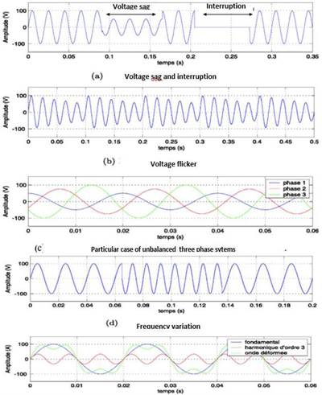

# Electrical Disturbances

- [Electrical Disturbances](#electrical-disturbances)
  - [Attacks on Electrical Disturbances](#attacks-on-electrical-disturbances)
  - [Attacks on a System’s Physical Environment](#attacks-on-a-systems-physical-environment)

---

## Attacks on Electrical Disturbances

- an attacker could launch an availability attack by interrupting or interfering with the electrical service available to a system.

- Example,
- if attacker gained physical access to a data center’s electrical system, he might be able to cause a variety of electrical disturbances, such as the following:
  - `Power spikes 长钉`: Excess 过度 power for a brief period of time
  - `Electrical surges`: Excess power for an extended period of time
  - `Power fault`: A brief electrical outage
  - `Blackout`: An extended electrical outage
  - `Power sag 下陷`: A brief reduction in power
  - `Brownout`: An extended reduction in power

- To combat such electrical threats:

- install `uninterruptable power supplies (UPS)` and `generator backups` for strategic devices in your network.

- routinely test the UPS and generator backups.
  - A `standby power supply (SPS)` is a lower-end version of a UPS.
  - Although it’s less expensive than a traditional UPS, an SPS’ battery is not in-line with the electricity coming from a wall outlet.
  - Instead, an SPS’ battery operates in parallel with the wall power, standing by in the event that the wall power is lost.
  - Because of this configuration, there is a brief period of time between a power outage and the SPS taking over, which could result in the attached equipment shutting down.

## Attacks on a System’s Physical Environment

- Attackers could also intentionally damage computing equipment by influencing the equipment’s physical environment. example, attackers could attempt to manipulate such environmental factors as the following:
  - `Temperature`: computing equipment generates heat (like in data centers or server farms), attacker can interferes with the operation of an air-conditioning system, the computing equipment could `overheat`.
  - `Humidity`:  computing equipment is intolerant of moisture, attacker can `cause physical damage` to computing equipment by `creating a high level of humidity` in computing environment.
  - `Gas`: Because gas can often be flammable 可燃的, attacker can injects gas into a computing environment, small sparks in that environment could cause a fire.

- Consider the following recommendations to mitigate 减轻 such environmental threats:
  - Computing facilities should be `locked` (and not accessible via a drop ceiling, a raised floor, or any other way other than a monitored point of access).
  - Access should require `access credentials` (like via a card swipe or a bio- metric scan).
  - Access points should be visually `monitored` (like via local security pesonnetnel or remotely via a camera system).
  - `Climate control systems` should maintain temperature and humidity, and send alerts if specified temperature or humidity thresholds are exceeded.
  - The `fire detection and suppression systems` should be designed not to damage electronic equipment.
