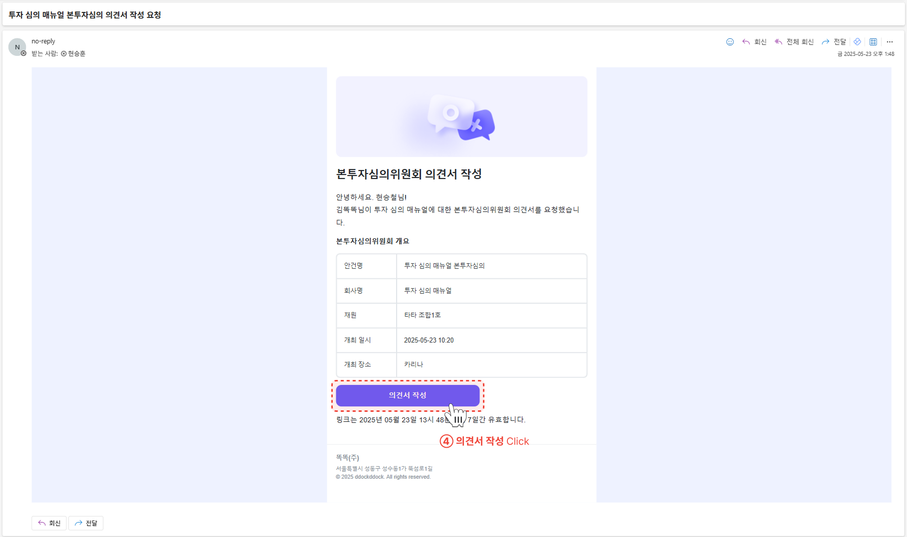

이 포스트는 cpu 성능 측정하는 방법에 대해 설명한다.

## Performance Metrics #1: Time

- wall-clock time, response time, or elapsed time: 실제로 걸린 시간을 의미한다. 
- cpu (execution) time: CPU time spent for a given program, user CPU time + system CPU time

이중 CPU time을 더욱 깊게 파보자.  
CPU는 clock을 통해 동기적으로 작동한다. (synchronous)  
- clock period: clock 한번 올라 갔다 내려오고 다시 올라가기 까지의 시간
- clock frequency(rate): clock period 역수, cycles per second

### Iron Law of CPU Performance
$$
\begin{aligned}
CPU time =& \frac{Seconds}{Program} \newline
=& \frac{Cycles}{Program} \times \frac{Seconds}{Cycle} \newline
=& \frac{Instructions}{Program} \times \frac{Cycles}{Instruction} \times \frac{Seconds}{Cycle}
\end{aligned}
$$

여기서 Instructions per Program 은 program이나 compiler에 따라 결정되는 것이고  
Cycles per Instruction(CPI)가 CPU hardware에 따라 결정되는 부분이다. 

이러한 방식으로 CPI를 계산한다. 그럼 CPI가 작은게 항상 좋은가?  
그건 모른다. 마지막에 clock period도 곱해줘야하고 각 program 마다 instruction 수도 다를거고 암튼 항상 좋은 건 아니다. 

## Performance Metrics #2: Rate

MIPS(million instructions per second)  
$$
MIPS = \frac{Instruction\space count}{Execution\space time\times 10^6}
$$
보통은 MIPS가 높으면 좋다.  
MFLOPS(million floating-point operations per second)도 있다. 

    

