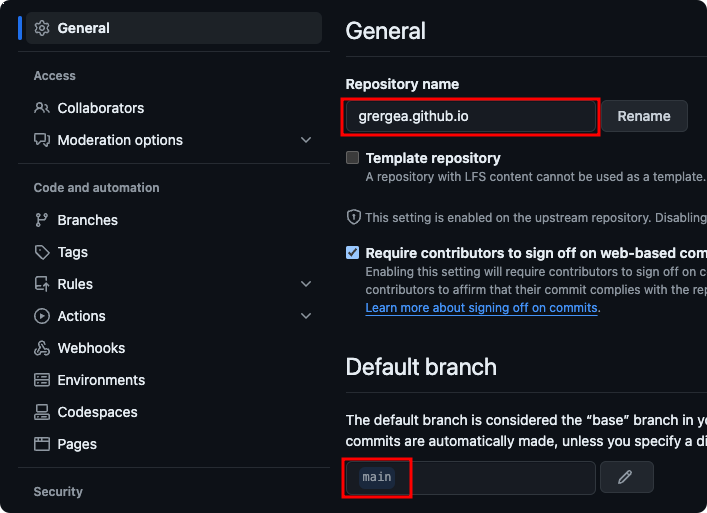

# 로컬 환경

---
```
Mac : M1, Sonoma 14.5
chirpy release : 7.0.1
Skill : shell, git 명령을 기본적으로 다룰 줄 알아야 합니다. 
```

# ruby 설치

---
```bash
> brew install ruby
```

# chirpy theme fork

---
* [jekyll-theme-chirpy](https://github.com/cotes2020/jekyll-theme-chirpy) 에서 fork
* Create a new fork -> Repository Name 입력 `(<github id>.hithub.io)`

## Github 저장소 환경 설정 (1)
* 나의 github 저장소 > Settings 경로의 순서로 이동 > Repository name 확인, Default  branch "main" 으로 변경


### Github 소스 Local clone 및 chirpy initialization
```bash
> git clone https://github.com/grergea/grergea.github.io.git
> cd grergea.github.io
> ./tools/init.sh # chirpy 초기화, 파일들이 생성되고 삭제된다.
> git add -A
> git commit -a -m 'first'
> git push origin main
> git rm .github/workflows/pages-deploy.yml  # Settings > Pages의 GitHub Actions을 사용하기 위해서 삭제 필요
> git commit -a -m 'first'
> git push origin main
```

## Github 저장소 환경 설정 (2)
* Github Action workflow 를 활성화
* Settings > Pages

* git 저장소에 .github/workflows/jekyll.yml 생성이 되는데, Local 도 sync 해줄 것.
```bash
> git pull
```

# chirpy 환경설정

---
## _config.yml 수정
```console
timezone: Asia/Seoul
title: Leesh Blog # the main title
tagline: I can handle it # it will display as the sub-title
url: "https://grergea.github.io"
  username: grergea # change to your github username
```

## _data/authors.yml
```console
Leesh:
  name: Leesh
  url: https://github.com/grergea/
```

## .DS_Store git 제외처리
> Mac Finder 로 git 저장소를 접근하면 .DS_Store 파일이 생성되는데, 불필요 하기 때문에 제외 처리
```bash
> echo .DS_Store >> .gitignore
```

# 포스팅 테스트

---
> _posts/yyyy-mm-dd-제목.md 의 형식으로 파일을 생성해야 페이지를 볼 수 있습니다.
```yaml
---
title: Jekyll Chirpy Theme
author: Leesh
categories: [jekyll, chirpy] 
tags: [jekyll, chirpy, github-blog, github, blog]
date: '2024-06-10 16:00:00 +0900'
---
```
