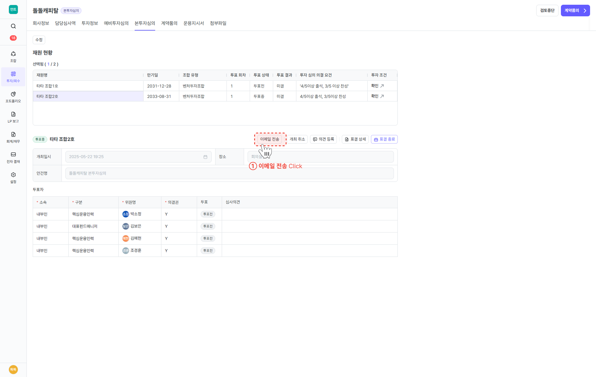

이 포스트는 ISA의 개념에 대해 설명한다.  

## Interface vs Implementation

Interface는 이 cpu의 작동 규칙을 적어놓은 것과 비슷하다. 실제 구현보다는 어떻게 명령어를 받을 것이고 어떻게 메모리를 관리할 것인지에 대한 약속 집합이라고 보는 것이 맞을 것 같다.  
Implementation은 실제 cpu 구현과 관련되어 있다. Interface에서 정한 약속대로 cpu가 작동하기 위한 실제 내부 구현을 의미한다. 

## The RISC-V Instruction Set
수많은 ISA중 우리는 RISC-V를 살펴볼 것이다. RISC(reduced instruction set computer) principle을 따른다. 

### register operands
RISC-V은 64bit의 크기를 가진 32개의 register를 가지고 있다. (x0~x31)  
64bit = 8byte = doubleword  
이것은 64비트 운영체제일 때가 그렇고 만약 32비트 운영체제이면 32bit크기 32개 이다.
각 register가 사용되는 용도가 어느정도 정해져있다.  
- x0: the constant value 0
- x1: return address
- x2: stack pointer
- x3: global pointer
- x4: thread pointer
- x5~x7, x28~x31: temp
- x8: frame pointer
- x9, x18~x27: saved registers
- x10: return value
- x11: function arguments/results
- x12~x17: function arguments

### memory operands
main memory에는 배열(array)와 같은 composite data가 저장되어 있다.  
load(ld)하면 memory에서 register로 data를 불러오고  
store(sd)하면 register에서 memory로 data를 저장한다. 
memory주소 하나에는 1byte가 저장된다.  
그렇다면 여기서 왜 32비트 운영체제가 4GB까지밖에 메모리를 못쓰는지에 대한 이유가 추론가능한데 32비트 운영체제에서는 register가 32bit라 주소 개수가 $$2^{32}$$개 이다. 각 주소에 1byte가 저장된다고 하면 총 $$2^{32}Byte = 4GB$$까지 저장가능하다.

이 예시를 보면 현재 A 배열을 base address가 x22에 저장되어 있는 것이다. A 배열이 doubleword크기를 가지는 자료형을 저장하고 있다고 가정하자. 그러면 A[8]의 메모리 주소를 찾기 위해서는 $$8칸\times 8byte$$만큼 이동해야한다. 따라서 64(x22)를 ld한다. 만약 저장하고 있는 자료형이 int였다면 32만큼 이동했을 것이다.

### Registers vs Memory
Register이 CPU입장에서는 훨씬 빠르다. Memory까지 갔다오게 되면 CPU는 상당히 많은 cycle손해를 본다

### Immediate Operands
addi x22, x22, 4  
처럼 register값에 상수를 더해주는 operand도 있다.

