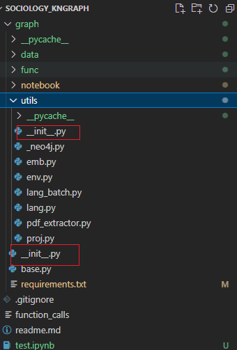

## 事故背景
在10月8日，我们经历了一次生产事故。事故的起因是Redis中的Redis Template的5个线程中有一个线程挂了，导致发送到该线程的所有请求都失败，进而引发了交易的原子自增异常，产生了生产数据问题。

在10月12日下午，生产环境再次出现异常，这次表现为Seata与应用之间的GPC超时。重启后恢复正常。此时，我们发现当前目录下有两份hprof文件，一份生成于10月8日10点40分 402M，另一份生成于10月12日16点21分 4.6G。于是，我们初步锁定两次事故是由于OOM引起的业务异常。

## 事故现象
### 10月8日的事故
11点30分，业务发现前端页面出现了`Unknown redis exception; nested exception is java.util.concurrent.RejectedExecutionException: event executor terminated。`由于无法立即判断Redis异常的原因，我们选择重启应用，重启后系统恢复正常。

### 10月12日的事故
16点40分，监控中发现大量审批查询出现慢SQL。初步排查发现是全局事务Seata的问题，同时在审批库中发现了一条undolog日志，但Seata中已经不存在该undolog的ID。Seata进程中还发现了多个GPC超时。为了尽快恢复业务，我们选择重启应用，重启后系统恢复正常。
## 排查过程

### 初步分析
在发现堆栈文件后，我们首先对12日生成的4.6G堆栈文件进行了分析。在堆栈文件中，我们发现了一个大对象，是在MyBatis查询时生成的。



因此，我们基本可以确定是由于查询的数据量过大导致的OOM。接着，我们在堆栈中找到了执行本次调用的方法：
`at com.zjrcu.paycenter.service.impl.PaymentApplyServicelmpl.dataDetailByProject(com.zjrcu.paycenter.form.ZfPaymentApplyDataSumForm)(line:549)`。

我们还在堆栈信息中找到了对应的SQL语句：
`SELECT  省略字段  FROM zf_payment_apply WHERE  del_flag=0 AND (status = ?)`。

这条语句基本上等于查询了全表，数据量约126万条，因此导致了OOM。在这里，我们基本可以确定12日的事故是由于代码缺陷导致的全表查询引发的OOM。

### 代码检查
代码如下所示：
```
    private LambdaQueryWrapper<ZfPaymentApply> parseQueryWrapperByPaymentApply(ZfPaymentApply zfPaymentApply) {
        return Wrappers.lambdaQuery(ZfPaymentApply.class)
                .eq(StringUtils.isNotBlank(zfPaymentApply.getOrgCode()), ZfPaymentApply::getOrgCode, zfPaymentApply.getOrgCode())
                .eq(zfPaymentApply.getStatus() != null, ZfPaymentApply::getStatus, zfPaymentApply.getStatus())
                // 省略，均为eq查询判断，对所有字段进行eq

    }
    @Override
    public List<ZfPaymentApplyDataDetailByProjectVO> dataDetailByProject(ZfPaymentApplyDataSumForm dataSumForm) {
        // 只查询已通过的数据
        ZfPaymentApply tempPaymentApply = new ZfPaymentApply();
        BeanUtils.copyProperties(dataSumForm, tempPaymentApply);
        tempPaymentApply.setStatus(BusinessStatusEnum.APPROVED.getValue());
        LambdaQueryWrapper<ZfPaymentApply> queryWrapper = parseQueryWrapperByPaymentApply(tempPaymentApply);
        List<ZfPaymentApply> zfPaymentApplyList = this.baseMapper.selectList(queryWrapper);
        }
```
在这里就出现一个问题，假如所有传入的参数全部为空，那么就会出现接近于全表查询的操作，只会拼接一个status以及默认的del_flag=0。这样的万能代码可能会出现较大的性能问题。


### 10月8日问题排查
在排查出10月12日的问题后，我们开始猜测，8号10点的问题是否也是由于查询全表导致内存溢出。我们打开8号的堆栈信息，发现堆栈信息总共只有402M，基本没有有用的信息。于是我们猜测hprof文件可能因为多次OOM而被覆盖。

查询日志发现，第一次OOM发生在10点29分，而hprof文件却是在10点40分生成的。我们再次查询日志，发现日志记录整整延迟了623秒，而12日的日志4.6G却只用了40秒。理论上，发生OOM后程序导出heapdump时应该是STW（Stop-The-World）状态，但事实并非如此。在发生OOM后，RedisTemplate也意外挂掉了一个线程。

由于无法从堆栈信息中获取任何有用的信息，我们推测可能是在导出过程中发生了GC，大对象被回收了。于是我们转向日志排查。在日志查询过程中，发现10点20分时出现了数据库连接异常。我们猜测这个问题大概率也与查询相关。

于是我们去CAM云监控平台查询当时的数据库监控信息，发现10点10分到10点12分之间出方向流量异常高。使用在线诊断工具发现了以下SQL语句： `SELECT 省略字段 FROM zf_payment_apply WHERE del_flag=0 AND (status = ?)`。

并且在10点10分时，发现进入controller的请求参数全为空的对象，进而导致查询出现OOM。

## 解决方案
为了避免这种情况，在开发中应尽量减少甚至避免使用这种万能查询。至少应该在查询前做一个全空判断，如果所有参数都为空，则抛出异常，防止出现全表查询的问题。具体解决方案如下：

参数校验：在执行查询前，检查传入的参数是否为空。如果所有参数都为空，则抛出异常，避免执行全表查询。
分页查询：对于可能返回大量数据的查询，强制要求使用分页查询，避免一次性加载过多数据。
优化查询条件：确保查询条件尽可能具体，避免使用过于宽泛的条件。
```
private LambdaQueryWrapper<ZfPaymentApply> parseQueryWrapperByPaymentApply(ZfPaymentApply zfPaymentApply) {
    LambdaQueryWrapper<ZfPaymentApply> queryWrapper = Wrappers.lambdaQuery(ZfPaymentApply.class)
            .eq(StringUtils.isNotBlank(zfPaymentApply.getOrgCode()), ZfPaymentApply::getOrgCode, zfPaymentApply.getOrgCode())
            .eq(zfPaymentApply.getStatus() != null, ZfPaymentApply::getStatus, zfPaymentApply.getStatus());
            // 省略，均为eq查询判断，对所有字段进行eq

    // 检查是否所有条件都为空
    if (queryWrapper.getExpression().getNormal().isEmpty()) {
        throw new IllegalArgumentException("查询条件不能为空");
    }

    return queryWrapper;
}

@Override
public List<ZfPaymentApplyDataDetailByProjectVO> dataDetailByProject(ZfPaymentApplyDataSumForm dataSumForm) {
    // 只查询已通过的数据
    ZfPaymentApply tempPaymentApply = new ZfPaymentApply();
    BeanUtils.copyProperties(dataSumForm, tempPaymentApply);
    tempPaymentApply.setStatus(BusinessStatusEnum.APPROVED.getValue());
    LambdaQueryWrapper<ZfPaymentApply> queryWrapper = parseQueryWrapperByPaymentApply(tempPaymentApply);
    List<ZfPaymentApply> zfPaymentApplyList = this.baseMapper.selectList(queryWrapper);
}
```


## 总结

通过对10月8日和10月12日两次生产事故的排查，我们发现了以下几点：

1. **查询全表导致OOM**：在两次事故中，均发现了由于查询条件不充分，导致了接近于全表查询的操作，进而引发了OOM。特别是在10月12日的事故中，明确发现了由于查询数据量过大导致的内存溢出。

2. **代码健壮性**：在代码检查中，我们发现了由于传入参数为空导致的全表查询问题。为了提高代码的健壮性，建议在查询前增加参数校验，避免全表查询的发生。

这次事故花费了较多的人力和时间来排查这个问题，处理问题也花费较长时间，希望可以通过这次事故引以为鉴。