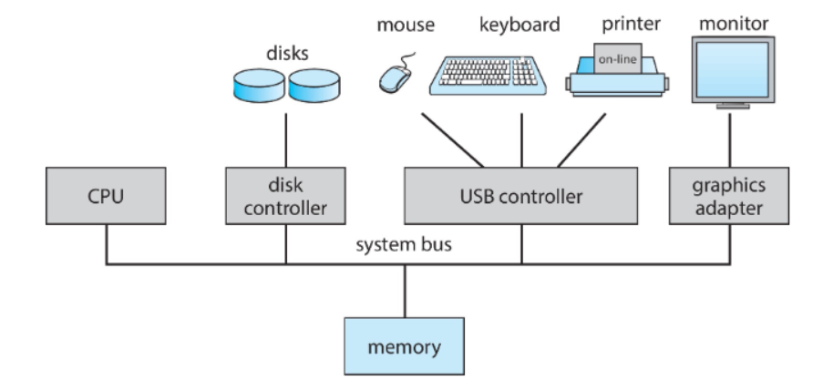
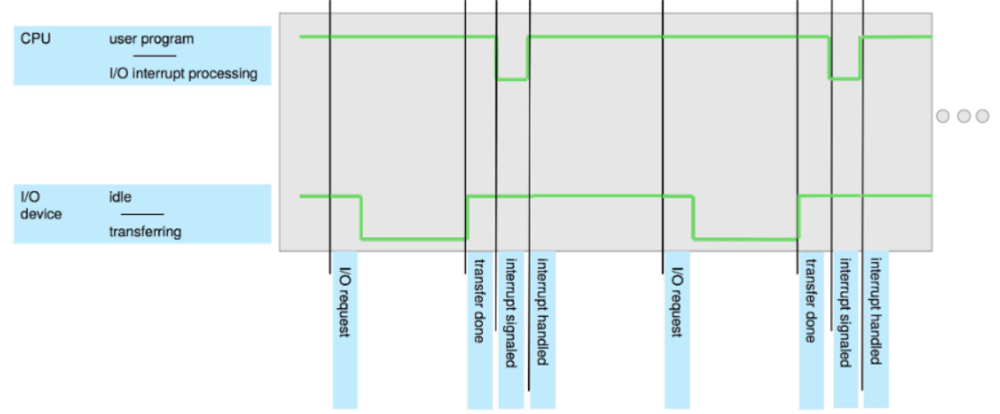
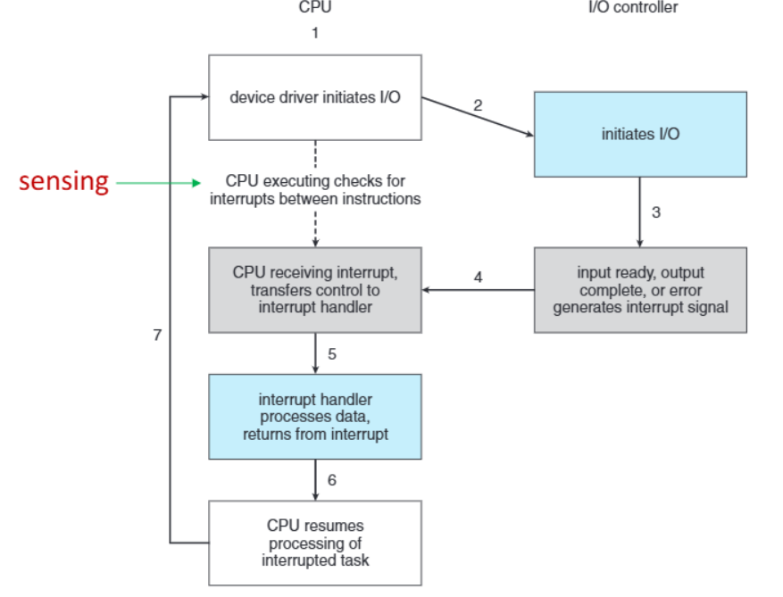
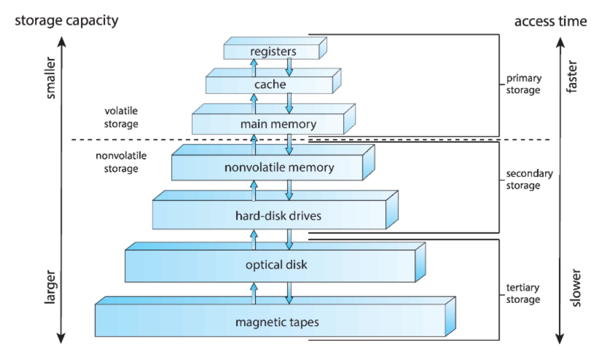
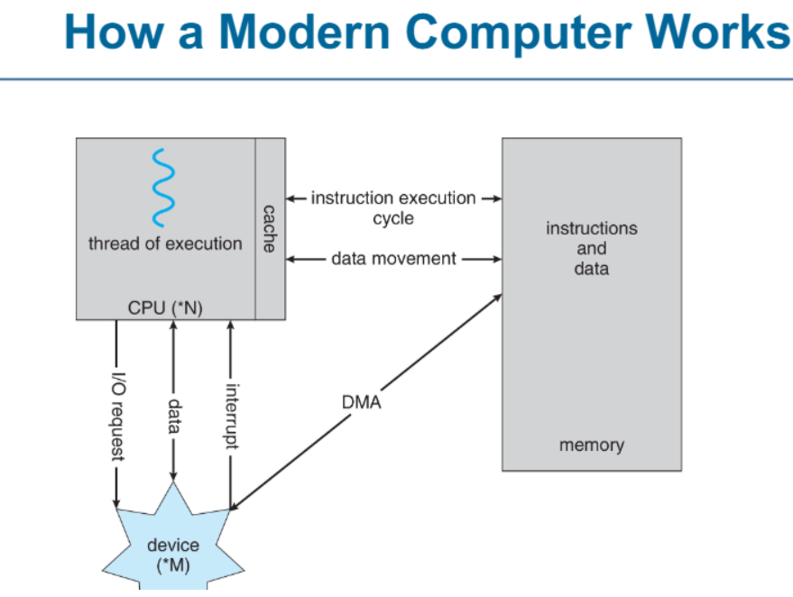
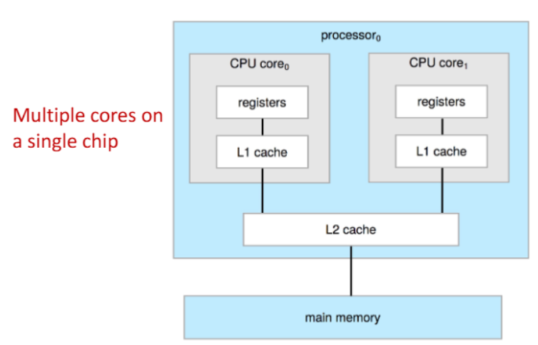
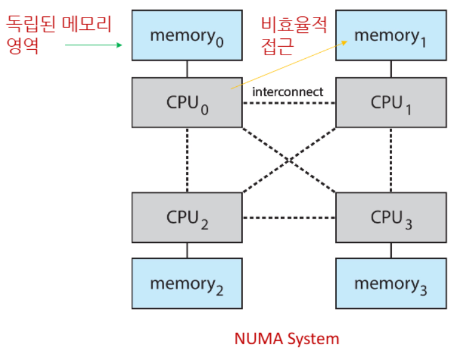
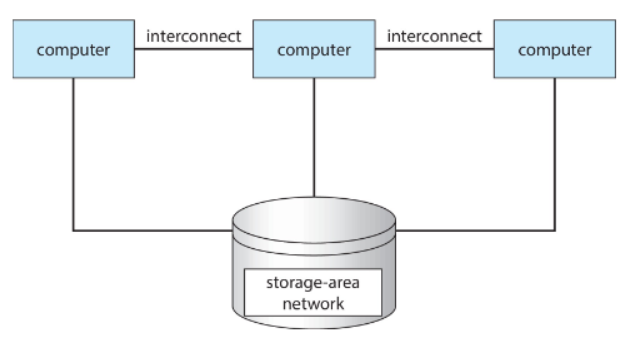

>🍀 운영체제 전공 수업 정리

## Operatrion System(OS)
<u>여러 서비스들을 유저들과 응용프로그램을 하드웨어가 사용할 수 있도록 도와주는 역할</u>

### Definition of OS
---
* 보는 관점에 따라 다를 수 있음 (사용자 <-> 개발자)
* 운영체제가 있는 이유: 하나 컴퓨터마다 하나의 프로그램만 작동하지 않음.  
  - 여러 프로그램을 하드웨어 같은 인프라를 가지고 효율적으로 돌리기위해 운영체제가 필요. 
  - 작은 메모리(RAM)만 가지고도 여러 프로그램을 돌릴 수 있음.
* Mobile devices like smartphones and tablets are resource poor,  optimized for usability and battery life
  : 모바일은 성능이 더 작으니 resource poor 하고, 배터리를 잘 관리하기 위해 운영체제가 여기에 맞춰 개발됨.
* 심지어 가전제품 등에도 CPU가 있고 OS도 있음. OS의 시발점은 군사용이었음.
 
### Concept of OS
---
1. No universally accepted definition
2. “The one program **running at all times** on the computer”is the <u>kernel</u>, part of the operating system
3. 그외 나머지는 system program(ships with the os, but not part of the kernel) 또는 
   application program(all programs not associated with os)이다.
4. middle ware: 개발자들을 위해 API를 제공해주는 계층, 사용자들이 보는 것보다 추상화되어 있음. 예시: 쿼리 등

>Computer System Organization

* 각각 **system bus**로 연결되어 있고, 이를 통해 다 연결이 되어 동시에(**Concurrent**) 운영이 된다. 
* Concurrent 과정에서 충돌은 피할 수 없다. 특히 메모리에 접근할 경우에 충돌은 빈번해서 메모리 접근은 느릴 수 밖에 없음.  
* I/O devices and the CPU can execute **Concurrently**
* **Local Buffer** 는 I/O device를 제어하기위한 <u>컨트롤러</u> 이다. 
* 함수 또는 특정 코드 블록 내에서 선언된 임시 저장 공간으로, 스택(stack) 메모리에 저장됨.  
* Each device controller type has an operating system **device driver** to manage it
* CPU moves data from/to main memory to/from local buffers. (컴퓨터 시스템에서 어떤 계산이든 CPU를 통해서 이루어 진다. 데이터의 이동조차.)
* Device controller informs CPU that it has finished its operation by causing an **interrupt**.

{:.prompt-warning}
>그럼 CPU들이 모든 일에 어떻게 관여하는가??
>

그걸 가능하게 하는게 **Interrupt** 이다.

## Interrupt
---
* Interrupt는 '방해하다'라는 뜻처럼 CPU가 하는 행위를 방해해서 여러 개의 일을 할 수 있도록 함.

### Function of Interrupt
---
* Interrupt transfers control to the interrupt service routine generally,  
  through the interrupt vector, which contains the addresses of all the service routines
  * 어떤 사건이 발생한 것을 알려주기 위해 CPU를 갑자기 중단을 시킴.
    마우스를 움직이면 마우스I/O에서 CPU에 interrupt를 검.  
    그럼 CPU가 멈추고 변경된 것을 반영. 이 과정의 <u>코드</u> 가 **interrupt service routines** 이다. 
* 디바이스마다 interrupt가 있는데, 각 interrupt를 구별하기 위해 **interrupt vector** 가 있다.(즉, interrupt의 index 역할)
* A **trap** or **exception** is a <u>software-generated interrupt</u>.
* OS is **interrupt driven**.
  * interrupt의 종류가 너무 많아서 계층 구조를 가진다.
    vector에서 번호가 하나만 주어지는 게 아니라, 그 주소의 table이 또 있다.(ex: 외과에도 셩형외과, 일반외과 있는 것처럼)

#### CPU가 interrupt가 걸린지 어떻게 아는가?
- The CPU hardware has a wire called the **interrupt-request line** that the CPU **senses** after executing every instruction.
(interrupt는 대략 1초에 2천번 정도 이루어 진다.)

>interrupt_timeline
### Interrupt Handling
---
* CPU가 interrupt가 걸리면 실행하던 코드를 멈추고 다른 코드를 실행함.  
  그리고 원래의 상태로 돌아가기 위해 **registers** (어느 하나의 register가 아니라 resgister의 집합)를 저장함.

#### interrupt 방식.
1. **polled** interrupt system
  - interrupt가 오면 확인하는 방식
2. **vectored** interrupt system
  - interrupt에 번호가 따라오는 방식(대부분 vector 사용)

#### Two interrupt request line
1. **nonmaskable interrupt**: unrecoverable errors(무조건 걸리는 interrupt)
2. **maskable interrupt**: can be turned off(안받아도 되는 interrupt)

* **Interrupt chaining**: each element in the interrupt vector points to the head of a list of interrupt handlers.
  - vector의 크기를 줄이기 위해 계층 구조를 가지고 있다.
* interrupt의 <u>우선순위</u>가 있는데 **interrupt priority level** 이라 하고 우선순위대로 실행됨.

>Interrupt-drive I/O Cycle
instruction중에 sensing을 통해 interrput 여부 확인
interrupt는 OS의 multitasking등을 이해하기 위한 기초

## Storage Structure
---
* main memory: only large storage media that the CPU can access <u>directly</u>
  - **Random access**
  - Typically **volatile(휘발성)**
  - Typically **random-access memory** in the form of **Dynamic Random-access Memory(DRAM)**
* Secondary storage: extension of main memory that provides large **nonvolatile(비휘발성)** storage capacity
  1. HDD(Hard Disk Drives): logically divided into **tracks**, which are subdivided into **sectors**
  2. NVM(Non-volatile memory) devices = SSD: faster than hard disk, Nonvolatile, Varios technologies, Becoming more popular(as capacity and performance increases, price drops).
  
### Storage Definitions and Notation
---
* bit: The basic unit of computer storage.
* byte: Is 8bits, the smallest convenient chunk of storage
* word: size of CPU's register(ex: 1word = 8byte in 64bits CPU)
(octec = 8 bit = 1 byte)

### Stroage Hierarchy
---
Storage systems organized in hierarchy(계층 구조)
1. speed: program
2. cost
3. volatility
   
* **Caching**: copying information into faster storage system
  * Main memory can be viewed as a cache for secondary storage
*  **Device Driver**: For each device controller to manage I/O
  * Provides uniform interface b/w controller and kernel

>Storage-Device Hierarchy
register, cache는 CPU안에 내장되어있고 가장 빠르고 용량이 적으며 비쌈.
밑으로 갈수록 용량이 크고 느리며 가격이 쌈.

>Working of Modern Computer 
#### DMA(direct memory access)
---
1. Used for high-speed I/O devices
2. Device controller transfers blocks of data **with out CPU intervention** (CPU의 부하를 줄임) 
  * 큰 데이터를 CPU가 처리하려면 하나씩 옮겨서 오래걸리기 때문에 CPU가 모두 관여하지 않고 시작과 끝만 관여함
3. Only one interrupt is generated **per block**, not per byte

## Computer-System Architecture
---
* Most systems use a **single general-purpose** processor
  * Most systems have **special-purpose processors** as well
* **Multiprocessors** systems growing in use and importance
  * Known as **parallel systems(병렬 시스템), tightly-coupled systems(밀결합 시스템)**
  
✅Advantages of Multiprocessor:
  1. Increased throughput(처리량) - 작업을 더 빠르게 처리 가능
  2. Economy of scale
  3. Increased reliability: 일부 프로세서가 계속 작동하여 시스템이 완전히 중단되지 않음.
  4. 
📝Types of Multiprocessor:
  1. Asymmetric Multiprocessing(비대칭 다중처리) - each processor is assigned a specific task
  2. Symmetric Multiprocessing(대칭 다중처리) - each processor performs all tasks

### Symmetric Multiprocessing Architecture
#### Multiple Cores on a Single Chip
---

>Symmetric Multiprocessing Architecture
* Multiple single-core chip
  * 두 개의 개별 프로세서가 하나의 시스템에서 동작하며, 병렬 처리 성능을 향상시킴.

#### Multi-chip and Multicore Systems
---

>Dual-Core Design
* Multi-chip and **multicore**
* Systems containing all chips
  * Chassis containing multiple separate systems(하나의 물리적 장치 내에 여러 개의 독립적인 컴퓨터 시스템이 존재하는 형태)

### NUMA System
---

* 여러 개의 CPU가 각각 독립적인 메모리(memory) 영역을 가지며, 다른 CPU의 메모리에 접근할 수도 있는 구조
* CPU 간 데이터를 공유할 수 있도록 **Interconnect(연결망)** 이 존재
* Scalability(확장성)이 뛰어나지만 **원격 메모리 접근은 성능 저하** 를 초래할 수 있음
* ex: Server, Data Center etc

### Clustered Systems
---

>Clustered Systems

* **Multiple systems** working together  
  (즉, 여러 대의 컴퓨터가 하나의 네트워크로 연결되어 공동 작업을 수행하는 방식)

✅Features of Clustered Systems
1. **Storage Sharing**
  * 일반적으로 **Storage Area Network(SAN)**를 통해 여러 시스템이 동일한 저장소를 공유함
  * 데이터 일관성 유지 가능
2. Provides a **High Availability**
  * 시스템 장애 발생 시 다른 노드가 대신 작업을 수행하여 서비스 중단을 방지.
  * **Asymmetric Clustering has one machine in hot-standby mode**
  * **Symmetric Clustering has multiple nodes running applications, monitoring each other**
3. Some clutsers are for **High-Performance Computing(HPC)**
  * App must be written to use **parallelizaion(병렬 처리)**
4. **Distributed Lock Manager(DLM)**
  * DLM to avoid conflicting operations on shared storage
  * 데이터 무결성을 유지하고, 동시 접근 문제를 방지