Dependiendo del sector económicos los proyectos pueden generar diferentes perspectivas. No es lo mismo un proyecto en el secotr de contrucción que un proyecto de IT. Para la gestión de tiempo en la insudtria de la construcción se puede tomar como herramienta el PERT /CPM, con herramienta se optimiza la utilización de tiempo para el desarrollo de actividades, evitando retrasos. 

## PERT Costo
Técnica de gestión de proyectos que se utiliza para planificar y controlar el tiempo de un proyecto, ayudando a los gestores a identificar el camino crítico y a estimar la duración total del proyecto. Esta técnica es especialmente útil para proyectos complejos con incertidumbre en los tiempos de ejecución.
PERT-costo amplía el análisis tradicional de PERT al incluir el análisis de costos asociados con las actividades del proyecto.

### Problema 1 - Distribución de actividades
A partir de la tabla de precedencias, duración en semanas y costos en millones de pesos. Realizar el grafo PERT correspondiente a la duración normal del proyecto, las actividades que componen el camino crítico y determinar el costo total del proyecto considerando que cada semana supone un costo de 25 millones.
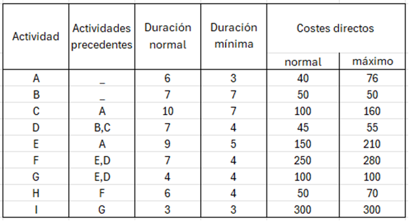

1. El primer paso será dibujar el grafo PERT para ello las actividades sin precedencia van directamente del inicio, para definir las demás actividades hay que ver cuáles las preceden, o sea cual deben cumplirse para que se realicen, se unen por flechas hasta que no queden más actividades, aquellas que no precedan a ninguna van directamente al fin.
  
2. El segundo paso es asignar la duración de las actividades, la duración normal es la que se verá reflejada en el grafo, esta ira del lado izquierdo, en el caso de las primeras actividades las cuales carecen de precedentes la duración se colocara en ambos apartados, en el caso del resto de las actividades el espacio de la derecha representara la suma de la duración normal de la actividad que le precede y de la actividad misma, en caso de que a una actividad le precedan dos o más se tomara la actividad de mayor duración.  
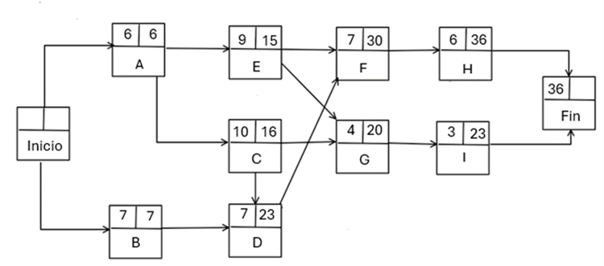
3. El siguiente paso es determinar una ruta crítica, retrocediendo desde el final hasta el inicio del grafo, siguiendo aquellas actividades que nos llevaron al número que tenemos en el nodo de fin, se puede marcar para tenerla presente o anotarla.

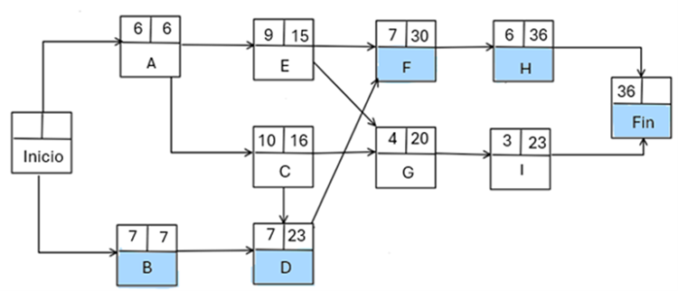

El resultado de la ruta crítica, son las actividades, _**B, D, F, H**_

Por último, queda calcular el costo del proyecto, en este caso sabemos que tenemos un costo designado de 25 millones de pesos por cada semana de duración del proyecto siento este caso 28 semanas.

$$36 \, (\text{semanas}) \times 25 \, (\text{millones de pesos}) = 900 \, \text{millones de pesos}$$

De igual forma deben considerarse los costos que implica cada actividad para tener el costo total real reflejado.

$$
CA + CB + CC + CD + CE + CF + CG + CH + CI = 40 + 50 + 100 + 45 + 150 + 250 + 100 + 50 + 300 = 1085
$$

El cálculo de los dos costos, sumado nos da el valor total del proyecto.

$$
C.T = 900 \, (\text{millones de pesos}) + 1085 = 900001085
$$

Para el sector de servicios en el caso específico para el desarrollo de IT se hace necesario utilizar metodologias agiles como **scrum, espiral, V, etc.**

Las organizaciones dedicadas a la producción de bienes exigen la planeación, el control, dirección de la producción y la logística.

## Costo mínimo
El método del costo mínimo o método de los mínimos costos es un algoritmo desarrollado con el objetivo de resolver problemas de transporte o distribución, arrojando mejores resultados que métodos como el de la esquina noroeste, dado que se enfoca en las rutas que presentan menores costos.

Dado que se trata simplemente de la asignación de la mayor cantidad de unidades posibles (sujeta a las restricciones de oferta y/o demanda) a la celda menos costosa de toda la matriz hasta finalizar el método.

### Algoritmo

- **Paso 1**:
De la matriz se elige la ruta (celda) menos costosa (en caso de un empate, este se rompe arbitrariamente) y se le asigna la mayor cantidad de unidades posible, cantidad que se ve restringida ya sea por las restricciones de oferta o de demanda. En este mismo paso se procede a ajustar la oferta y demanda de la fila y columna afectada, restándole la cantidad asignada a la celda.
- **Paso 2**:
En este paso se procede a eliminar la fila o destino cuya oferta o demanda sea 0 después del «Paso 1», si dado el caso ambas son cero arbitrariamente se elige cual eliminar y la restante se deja con demanda u oferta cero (0) según sea el caso.
- **Paso 3**:
Una vez en este paso existen dos posibilidades, la primera que quede un solo renglón o columna, si este es el caso se ha llegado al final el método, «detenerse».
La segunda es que quede más de un renglón o columna, si este es el caso iniciar nuevamente el «Paso 1».

### Problema 1. Distribución de minerales
Una empresa minera tiene 3 almacenes A (oro), B (plata) y C (bronce) con diferentes cantidades de minerales disponibles y quiere minimizar costos al enviar los minerales a cuatro zonas, a continuación se muestra la oferta, demanda y los costos en las siguientes tablas:

| Oferta  | Oro | Plata | Bronce |
| ------- | --- | ----- | ------ |
| Almacen | 50  | 60    | 70     |

La minera necesita distribuir estos minerales a 4 zonas (Z1, Z2, Z3 y Z4) con demandas específicas:

| Demanda | Z1  | Z2  | Z3  | Z4  |
| ------- | --- | --- | --- | --- |
| Zona    | 40  | 30  | 50  | 60  |

El costo de transportar una unidad de mineral desde cada almacén a cada zona se muestra en la siguiente tabla:

| Origen-Destino | Oro | Plata | Bronce |
| -------------- | --- | ----- | ------ |
| Z1             | 2   | 4     | 3      |
| Z2             | 3   | 5     | 2      |
| Z3             | 1   | 6     | 4      |
| Z4             | 5   | 7     | 1      |

El objetivo de la empresa es determinar la distribución de minerales desde sus almacenes a las diferentes zonas de manera que se minimice el costo total de transporte.

#### **Solución**

Se inicia realizando una tabla donde se muestran todos los datos necesarios para resolver el problema por Método de búsqueda de costo mínimo, como se muestra a continuación: 

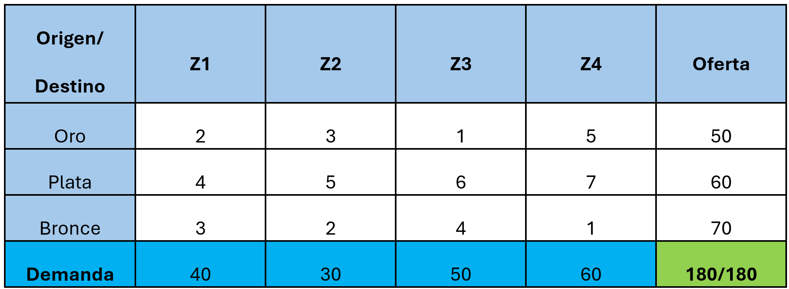

Inmediatamente se comienza a identifican las rutas (celdas) con menor costo unitario para cada zona, es decir, las iteraciones que se muestran a continuación: 

**Iteración 1**

Se identifica la celda que contenga el costo más bajo, si hay valores iguales (empate), se elige el que más guste y se asigna la oferta con respecto a la demanda hasta satisfacer ambas partes, como se muestra:

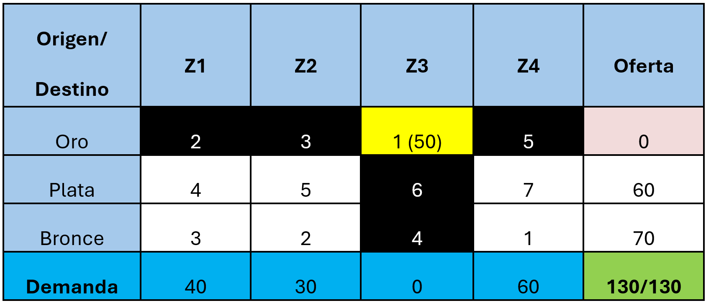

**Iteración 2**

Se repite el proceso nuevamente:

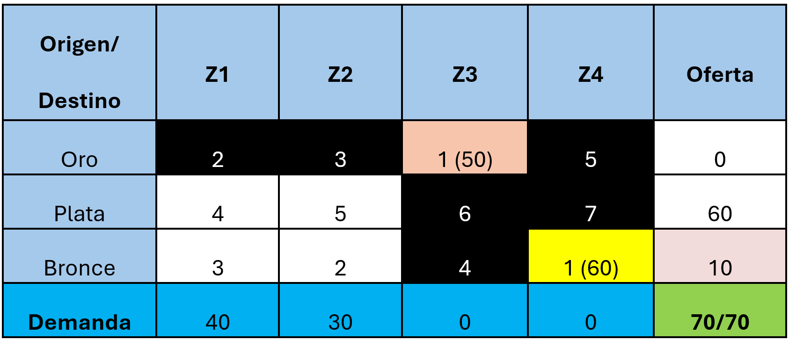

**Iteración 3**

Se repite el proceso nuevamente:

**Iteración Final**

Cuando solo se tiene una fila o columna, se coloca la oferta y/o demanda restante a las celdas para poder satisfacer ambas, como se muestra a continuación:

Para finalizar solo se debe calcular el costo total de las rutas óptimas, es decir, calcular la sumatoria del precio por el número de unidades asignadas, como se muestra a continuación:

$$
CT = 4(40) + 5(20) + 2(10) + 1(50) + 1(60) = 390
$$

## Esquina Noroeste

Este método comienza con la formulación del problema en forma de una matriz, donde las filas representan las fuentes y las columnas los destinos. Después, el algoritmo comienza en la esquina noroeste de la tabla. A continuación, te mostraré cómo puedes aplicar este método en tu empresa.

### Algoritmo

- **Paso 1**:
En la esquina noroeste de la tabla, asignamos la mayor cantidad de unidades que sea posible, limitada por las restricciones tanto de oferta como de demanda. Luego, ajustamos las cantidades disponibles en la fila y columna correspondientes, restando la cantidad asignada en esa celda.
- **Paso 2**:
En este paso, eliminamos la fila o columna cuya oferta o demanda sea cero después del "Paso 1". Si ambas son cero, se elige arbitrariamente cuál eliminar, dejando la otra con una demanda u oferta igual a cero, según corresponda.
- **Paso 3**:
Una vez alcanzado este paso, hay dos posibilidades: la primera es que quede solo una fila o columna; en ese caso, el método ha llegado a su conclusión y se detiene.
La segunda posibilidad es que queden más de una fila o columna. En este caso, se reinicia el "Paso 1".

### Problema 1. Distribución de minerales
Una empresa minera tiene 3 almacenes A (oro), B (plata) y C (bronce) con diferentes cantidades de minerales disponibles y quiere minimizar costos al enviar los minerales a cuatro zonas, a continuación se muestra la oferta, demanda y los costos en las siguientes tablas:

| Oferta  | Oro | Plata | Bronce |
| ------- | --- | ----- | ------ |
| Almacen | 50  | 60    | 70     |

La minera necesita distribuir estos minerales a 4 zonas (Z1, Z2, Z3 y Z4) con demandas específicas:

| Demanda | Z1  | Z2  | Z3  | Z4  |
| ------- | --- | --- | --- | --- |
| Zona    | 40  | 30  | 50  | 60  |

El costo de transportar una unidad de mineral desde cada almacén a cada zona se muestra en la siguiente tabla:

| Origen-Destino | Oro | Plata | Bronce |
| -------------- | --- | ----- | ------ |
| Z1             | 2   | 4     | 3      |
| Z2             | 3   | 5     | 2      |
| Z3             | 1   | 6     | 4      |
| Z4             | 5   | 7     | 1      |

El objetivo de la empresa es determinar la distribución de minerales desde sus almacenes a las diferentes zonas de manera que se minimice el costo total de transporte.

#### **Solución**
Se inicia realizando una tabla donde se muestran todos los datos necesarios para resolver el problema con el método de la esquina noroeste, como se muestra a continuación: 

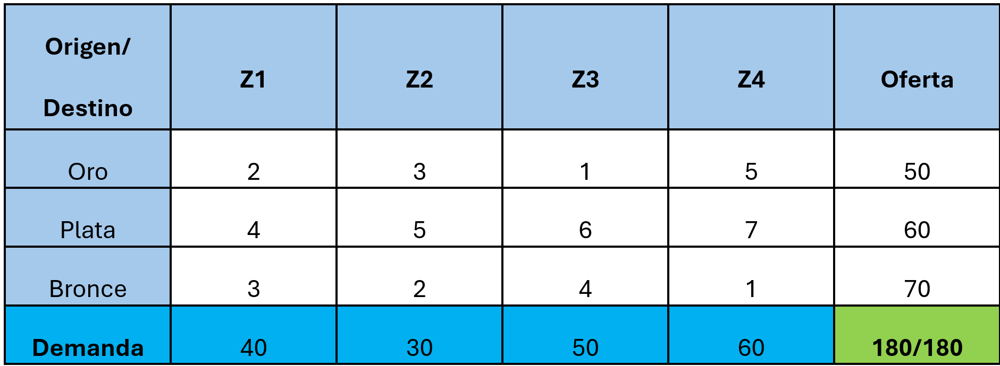

Después se inicia con la esquina noroeste, es decir, se comienza con la esquina superior izquierda y se realiza la asignación de unidades conforme a la oferta y demanda, así como las iteraciones que se muestran a continuación:

**Iteración 1**

Se inicia desde la esquina superior izquierda y se asigna la oferta con respecto a la demanda hasta satisfacer ambas partes, como se muestra a continuación:

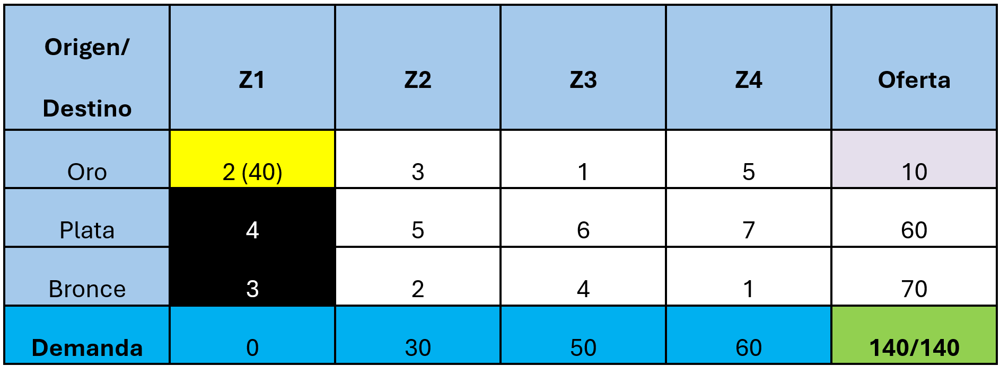

**Iteración 2**

Se vuelve a iniciar desde esa esquina hasta terminar de satisfacer todas las partes

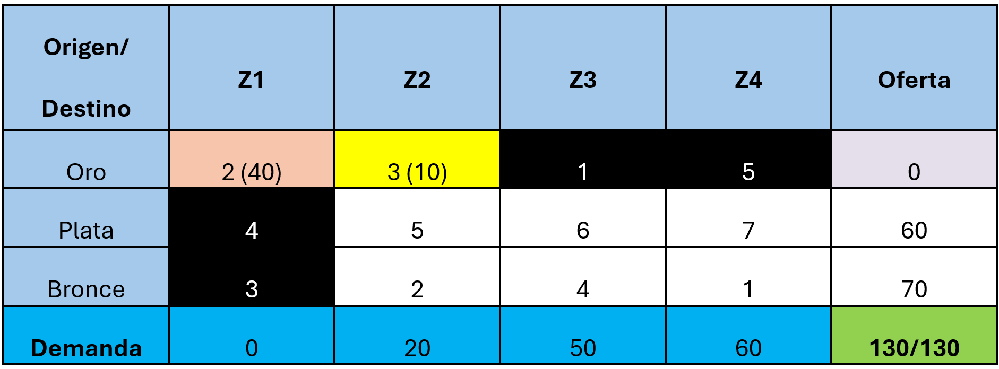

**Iteración 3**

Se repiten los pasos nuevamente

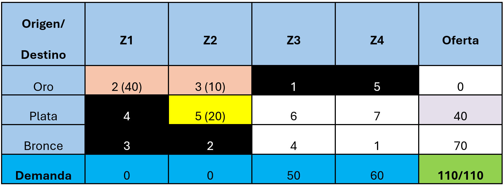

**Iteración 4**

Se repiten los pasos nuevamente

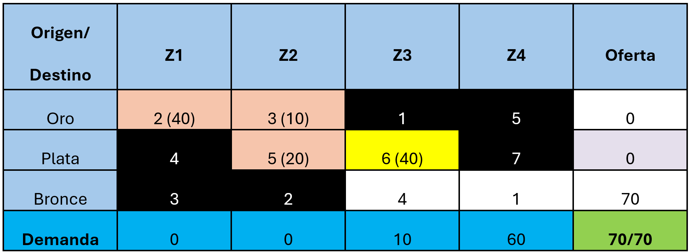

**Iteración Final**

Al solo tener una fila o columna, se coloca la oferta o demanda restante a las celdas para poder satisfacer ambas partes, como se muestra a continuación:

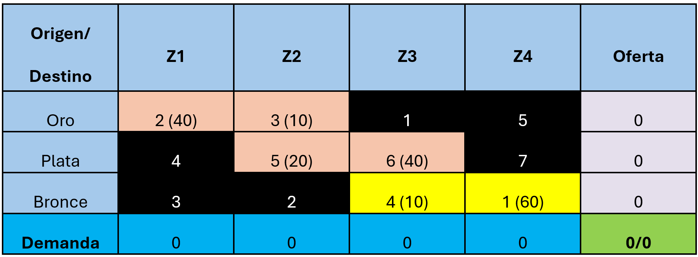

Al final solo se debe calcular el costo total de las rutas optimas (asignaciones), es decir, calcular la sumatoria del costo de envío por el número de unidades asignadas en color amarillo, como se muestra a continuación:

$$
CT = 2(40) + 3(10) + 5(20) + 6(40) + 4(10) + 1(60) = 550
$$

Para el sector de servicios en el caso específico para el desarrollo de IT se hace necesario utilizar metodologias agiles como **scrum, espiral, V, etc**.

## Aplicaciones prácticas de la gestión del tiempo
- **Eventos y producción:** La organización de eventos y la producción de bienes y servicios requieren una coordinación precisa de actividades y recursos para cumplir con los plazos establecidos. 
  > La gestión del tiempo permite planificar y controlar la logística del evento, la asignación de tareas a los miembros del equipo y la gestión de los proveedores (Meredith, Shafer & Mantel, 2017, p. 311).
 
## Perspectivas de mejora de la gestión del tiempo
- **Optimización de procesos:** La gestión del tiempo no solo se enfoca en cumplir con el cronograma, sino también en identificar áreas de mejora en los procesos del proyecto para reducir el tiempo de ejecución. 
  > Esto implica analizar los flujos de trabajo, eliminar actividades redundantes y aplicar técnicas de mejora continua (Kerzner, 2013, p. 238).
- **Automatización:** La implementación de herramientas y tecnologías para automatizar tareas repetitivas puede liberar tiempo valioso para actividades más estratégicas y creativas. 
  > La automatización puede aplicarse en diversas áreas del proyecto, como la gestión de documentos, la comunicación interna y el seguimiento del progreso (Lock, 2020, p. 120).
- **Capacitación y desarrollo:** La formación continua del equipo de proyecto en técnicas y herramientas de gestión del tiempo es esencial para mejorar su eficiencia y productividad. 
  > Esto permite a los miembros del equipo desarrollar habilidades para estimar el tiempo de manera precisa, planificar su trabajo de manera efectiva y utilizar herramientas tecnológicas para optimizar su desempeño (Levin, 2018, p. 105).

## Actividad 10: Completa los espacios en blanco - Fundamentos de la gestión del tiempo
- **Objetivo:** _Relacionar correctamente las principales herramientas, técnicas y sectores aplicables a la gestión del tiempo con sus respectivas descripciones y usos en proyectos reales, con el fin de consolidar los conocimientos adquiridos en la unidad 1.4.2._
- **Instrucciones:** 
  - _1.	Lee cuidadosamente los conceptos que aparecen en la columna A (izquierda) y las descripciones o aplicaciones en la columna B (derecha)._
  - _2.	Empareja cada elemento de la columna A con la opción que mejor lo describa en la columna B._

[Da clic para ir a la actividad](https://puzzel.org/es/matching-pairs/play?p=-OQWyjBSH2-ncq2lBaKZ)
