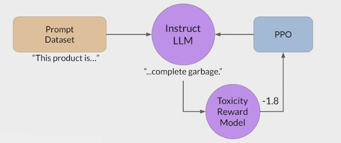
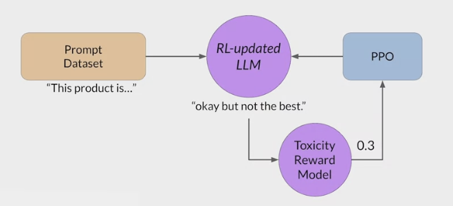
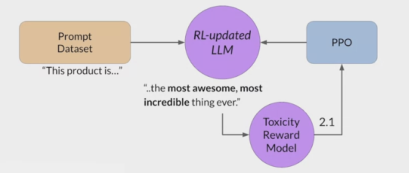
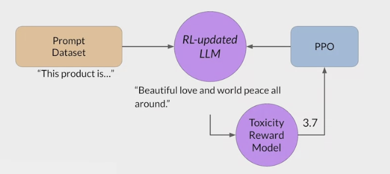
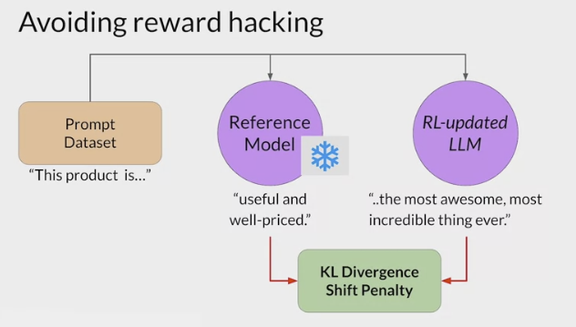
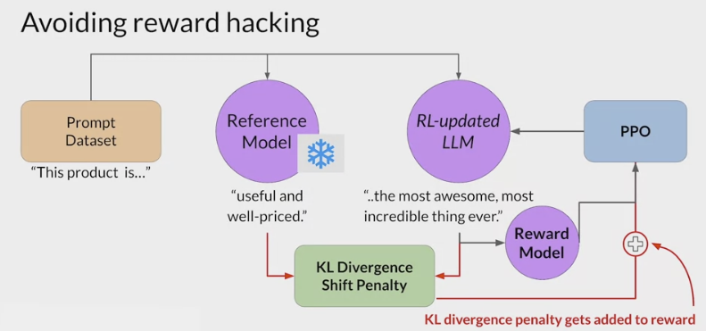
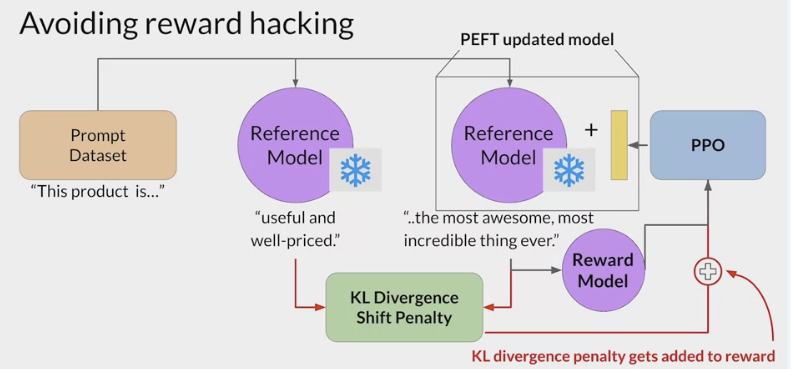
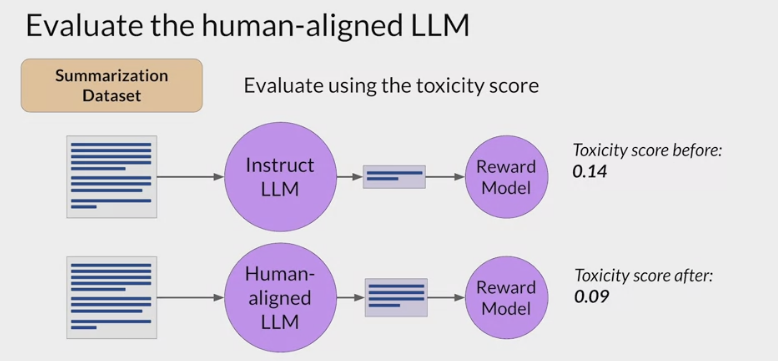

# RLHF: Problem

- [RLHF: Problem](#rlhf-problem)
  - [Reward hacking](#reward-hacking)
  - [Assess the RL-updated model's performance.](#assess-the-rl-updated-models-performance)

---

## Reward hacking

- An interesting problem that can emerge in reinforcement learning is known as reward hacking
- the agent learns to cheat the system by favoring actions that maximize the reward received even if those actions don't align well with the original objective.
- reward hacking can manifest as the addition of words or phrases to completions that result in high scores for the metric being aligned.
- But that reduce the overall quality of the language.

For example,
- using RHF to detoxify and instruct model
- trained a **reward model** that can carry out sentiment analysis and classify model completions as `toxic or non-toxic`.

- select a prompt from the training data, and pass it to the instruct an LLM which generates a completion.
  - 
  - complete garbage is not very nice, expect it to get a high toxic rating.

- The completion is processed by the **toxicity of reward model**, which generates a score and this is fed to the PPO algorithm, which uses it to update the model weights.
  - As you iterate RHF will update the LLM to create a less toxic responses.
  - 

- However, as the policy tries to optimize the reward, it can  diverge too much from the initial language  
  - 
    - the model started generating  completions that it has learned will lead to very low toxicity scores  by including phrases like most awesome, most incredible.
    - This language sounds very exaggerated.
  - 
    - The model also start generating  nonsensical, grammatically incorrect text that just happens to maximize the rewards in a similar way , outputs like this are definitely not very useful.

To prevent Reward hacking:

- use the initial instruct LLM as performance reference.
  - call it the **reference model**.
  - The weights of the reference model are frozen and are not updated during iterations of RHF.
  - always maintain a single reference model to compare to.

- During training, each prompt is passed to both models, generating a completion by the reference LLM and the intermediate LLM updated model.
  - compare the two completions and calculate a value called the **Kullback-Leibler (KL) divergence**
  -  KL divergence 
    - a statistical measure of how  different two probability distributions are .
    - use it to compare the completions off the two models
    - determine how much the updated model has diverged from the reference.
    - KL divergence is calculated for each generated token across the whole vocabulary off the LLM.
    - This can easily be tens or hundreds of thousands of tokens. However, using a softmax function, you've reduced the number of probabilities to much less than the full vocabulary size.
    - a relatively compute expensive process with will almost always benefit from using GPUs.

- calculated the KL divergence between the two models, added acid term to the reward calculation.
  - This will penalize **the RL-updated model** if it shifts too far from the **reference LLM** and generates completions that are two different.
  - now need to full copies of the LLM to calculate the KL divergence, the frozen **reference LLM**, and the **RL-updated PPO LLM**.

- benefit from combining our relationship with puffed.
  - In this case, only update the weights of a path adapter, not the full weights of the LLM.
  - you can reuse the same underlying LLM for both the reference model and the PPO model, which you update with a trained path parameters.
  - This reduces the memory footprint during training by approximately half.

---

## Assess the RL-updated model's performance.

use the summarization data set to quantify the reduction in toxicity
- for example: use toxicity score, the probability of the negative class, a toxic or hateful response averaged across the completions.
- If RHF has successfully reduce the toxicity of the LLM, this score should go down.
- First, create a baseline toxicity score for the original instruct LLM by evaluating its completions off the summarization data set with a reward model that can assess toxic language.
- Then evaluate the newly human aligned model on the same data set and compare the scores.
- In this example, the toxicity score has indeed decreased after RLHF, indicating a less toxic, better aligned model.
