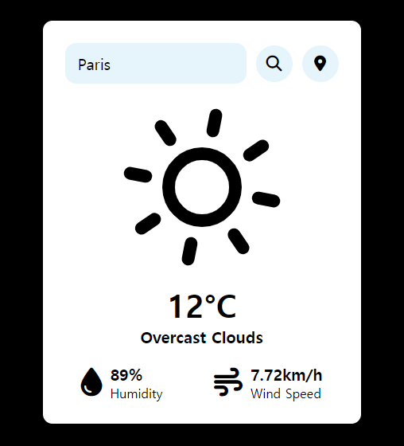
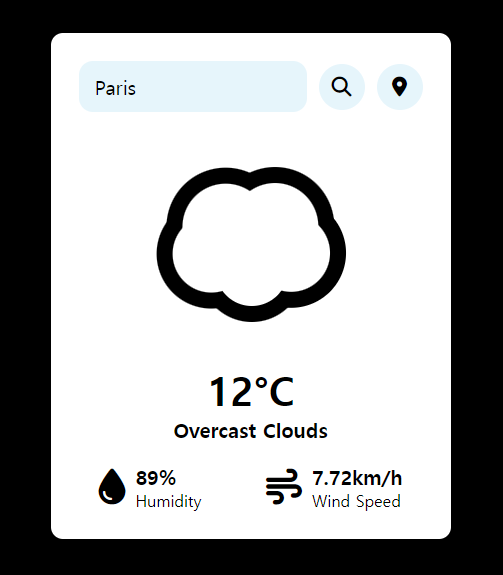

안녕하세요🖐️

지금까지 만든 날씨 위젯은 아직 아무런 기능 구현이 되지 않았죠?

오늘은 날씨를 검색하면 실제로 날씨가 출력될 수 있도록 기능 구현 작업을 해주도록 할께요😁

***

## DOM 요소 선택 및 변수 할당

### script.js

```js
const inputBox = document.querySelector(".input-box");
const searchBtn = document.getElementById('searchBtn');
const locationBtn = document.getElementById('locationBtn');
const temperature = document.querySelector('.temperature');
const description = document.querySelector('.description');
const humidity = document.getElementById('humidity');
const wind_speed = document.getElementById('wind-speed');
```

먼저 script.js 파일에 변수를 할당해주도록 할게요. 이 코드를 파일의 가장 윗부분에 입력합니다.

***

## OpenWeatherMap API

날씨 데이터를 가져와서 날씨 위젯에 표현하려면 API를 활용해야 합니다!

저는 **OpenWeatherMap API**를 사용했습니다. API를 사용하기 위해 우선 아래 사이트 회원 가입을 해주세요

[OpenWeatherMap 회원 가입]("https://openweathermap.org/")

회원 가입을 하고 자신의 **API Key**를 복사합니다.

[API key 가져오기]("https://home.openweathermap.org/api_keys")

다음으로 상단 배너의 API => Current Weather Data의 [API doc]("https://openweathermap.org/current")를 들어가면

**Built-in API request by city name**가 나옵니다. (한참 내려야 합니다😂)

{:style="border:1px solid #ababab; border-radius: 10px;"}

API를 call할 수 있는 URL도 복사해 줍니다!

***

### script.js

```js
async function checkWeather(city) {
    const api_key = "당신의 API key";
    const url = `https://api.openweathermap.org/data/2.5/weather?q=${city}&appid=${api_key}`;
    const weather_data = await fetch(`${url}`).then(response => response.json());

    console.log(weather_data)
}

searchBtn.addEventListener('click', () => {
    checkWeather(inputBox.value);
});

inputBox.addEventListener('keypress', (event) => {
    if (event.key === "Enter") {
        checkWeather(inputBox.value);
    }
});
```

사용자가 도시 이름을 입력하면, OpenWeatherMap API를 호출해서 날씨 데이터를 가져옵니다.

**url 변수**가 API 호출을 위한 URL을 생성하고 api_key 변수가 API를 호출할 때 인증을 합니다.

**fetch 함수**는 지정된 URL로 HTTP 요청을 보내고 완료될 때까지 await로 기다렸다가 응답 객체를 JSON 형식으로 변환하는 함수입니다.

또한 검색 버튼이 눌렸을 때, 엔터 키가 입력되었을 때 checkWeather 함수를 호출하는 코드를 작성해 주었습니다.

***

#### console 창 출력 결과

{:style="border:1px solid #ababab; border-radius: 10px;"}

서울을 검색한 후 console 창을 열어보았습니다.

API 호출이 완벽하게 잘 되었네요!

다음으로 console 창에 출력된 내용을 바탕으로 **Data Mapping**을 해야 됩니다.

***

## Data Mapping

### script.js #1

```js
temperature.innerHTML = `${Math.round(weather_data.main.temp - 273.15)}°C`;
description.innerHTML = `${weather_data.weather[0].description}`;
humidity.innerHTML = `${weather_data.main.humidity}%`;
wind_speed.innerHTML = `${weather_data.wind.speed}km/h`;
```

checkWeather 함수에 위 코드를 작성했어요😊

weather_data.main.temp는 API로부터 받은 온도 데이터로, 켈빈(Kelvin) 단위입니다.

켈빈을 섭씨로 변환하고 반올림하기 위해 Math.round(weather_data.main.temp - 273.15)를 사용했습니다.

***

#### 구현 결과

{:style="border:1px solid #ababab; border-radius: 10px;"}

프랑스 파리를 검색해보았습니다.

날씨의 상세 설명과 온도, 습도, 풍속 모두 잘 나옵니다!!

근데 설명은 분명 Overcast Clouds인데 Skycon은 해 아이콘이 나오네요...

아이콘도 잘 나타나도록 수정해보겠습니다.

***

### script.js #2

```js
async function checkWeather(city) {
    const api_key = "당신의 API key";
    const url = `https://api.openweathermap.org/data/2.5/weather?q=${city}&appid=${api_key}`;
    const weather_data = await fetch(`${url}`).then(response => response.json());
    
    temperature.innerHTML = `${Math.round(weather_data.main.temp - 273.15)}°C`;
    description.innerHTML = `${weather_data.weather[0].description}`;
    humidity.innerHTML = `${weather_data.main.humidity}%`;
    wind_speed.innerHTML = `${weather_data.wind.speed}km/h`;

    let weatherType = weather_data.weather[0].main.toLowerCase();

    switch (weatherType) {
        case 'clouds':
            icons.set("weather-icon", Skycons.CLOUDY);
            break;
        case 'clear':
            icons.set("weather-icon", Skycons.CLEAR_DAY);
            break;
        case 'rain':
            icons.set("weather-icon", Skycons.RAIN);
            break;
        case 'mist':
            icons.set("weather-icon", Skycons.FOG);
            break;
        case 'snow':
            icons.set("weather-icon", Skycons.SNOW);
            break;
        default:
            icons.set("weather-icon", Skycons.CLEAR_DAY);
    }

    icons.play();
}
```

switch문을 통해서 여러 날씨 별로 표현되는 아이콘을 각기 다르게 설정해주었습니다!

***

#### 구현 결과

{:style="border:1px solid #ababab; border-radius: 10px;"}

구름 모양이 잘 나왔네요☁️☁️

다음 시간에는 위치를 기반으로 날씨를 출력하는 기능을 코딩하겠습니다.

수고하셨어요👏👏
